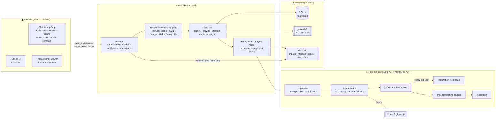
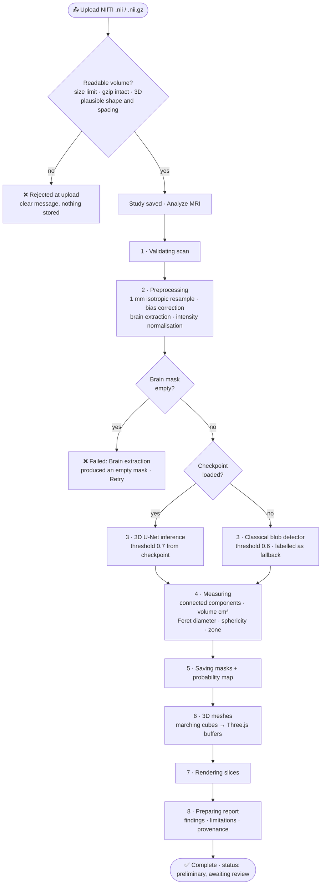
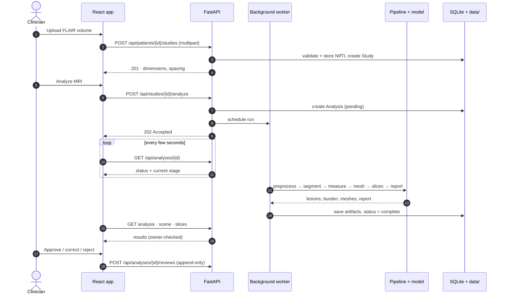
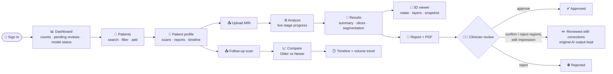
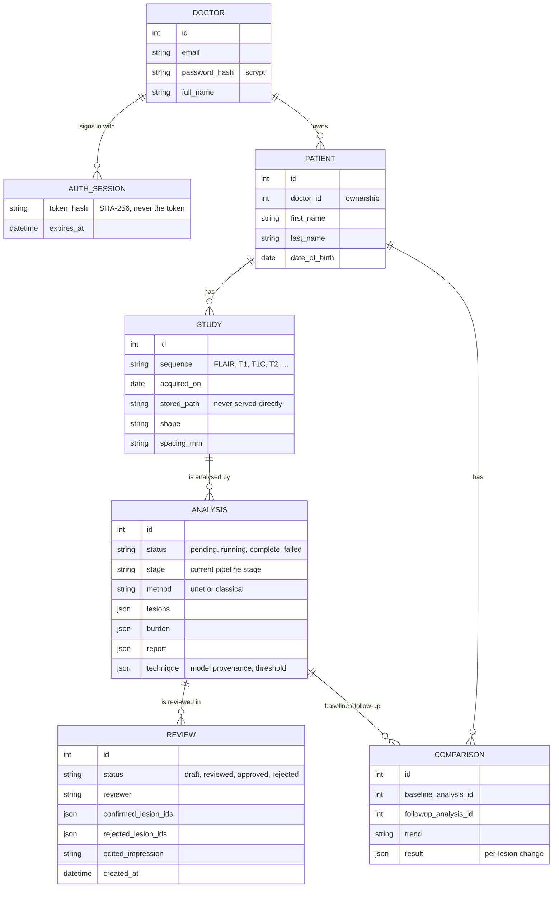
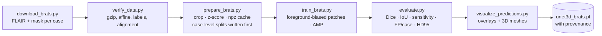

<div align="center">

# 🧠 NeuroVision AI

### From a raw brain MRI to a measured, 3D, clinician-reviewed report in one workflow.

AI segmentation of focal brain lesions, millimetre-accurate quantification,
an interactive 3D brain, scan-to-scan change tracking and a structured PDF report,
all in a doctor-facing web app that keeps the clinician in charge of every finding.


</div>

> [!WARNING]
> **Not a medical device. Not a diagnosis.** Nothing here is cleared or approved
> by any regulator. Every report stays *preliminary* until a qualified clinician
> records a review, and no code path finalises a report without one. The system
> shows **where** signal is abnormal. It does not determine **what** a region is.

---

## Contents

- [Why NeuroVision AI](#why-neurovision-ai)
- [Highlights](#highlights)
- [Use cases](#use-cases)
- [The model: read this first](#the-model-read-this-first)
- [Architecture](#architecture)
- [How an analysis runs](#how-an-analysis-runs)
- [Clinician workflow](#clinician-workflow)
- [Data model](#data-model)
- [Quick start](#quick-start)
- [Tech stack](#tech-stack)
- [API at a glance](#api-at-a-glance)
- [Training a real model](#training-a-real-model)
- [Design decisions worth knowing](#design-decisions-worth-knowing)
- [Project layout](#project-layout)
- [Tests](#tests)
- [Limitations](#limitations)
- [Attribution](#attribution)

---

## Why NeuroVision AI

Reading a brain MRI for focal lesions means scrolling hundreds of slices,
estimating sizes by eye, and comparing against last month's scan from memory.
NeuroVision AI does the slow, mechanical part:

- **finds** regions of abnormal signal with a trained 3D U-Net,
- **measures** each one: volume in cm³, longest diameter, shape and location,
- **shows** them on the slices and inside an interactive 3D brain,
- **compares** follow-up scans lesion by lesion after registering them,
- **drafts** a structured report and PDF,

and then **stops**. A clinician reviews, corrects or rejects the AI output, and
that decision is stored next to the original. Nothing is presented as a
diagnosis, and every number says where it came from.

---

## Highlights

| | |
|---|---|
| 🎯 **3D lesion segmentation** | 3D U-Net trained on BraTS 2024 adult glioma (FLAIR), running at its own tuned operating point |
| 📏 **Real quantification** | Per-lesion volume (cm³), Feret diameter, sphericity, approximate anatomical zone, total lesion load |
| 🧭 **Slice viewer** | Every slice in axial, coronal and sagittal planes, with overlay, mask and probability-map layers, zoom and pan, rendered on demand |
| 🧊 **Interactive 3D brain** | Lesions in the patient's own millimetre frame, shown inside a 437-structure anatomical atlas or the patient's own brain surface |
| 📈 **Longitudinal comparison** | Rigid registration plus lesion matching: each lesion is new, resolved, increased, decreased or stable, with a ±20% noise band |
| 📝 **Reports and PDF** | Structured findings, limitations and model provenance; 3D snapshots embedded; review state printed on every page |
| 👩‍⚕️ **Human in the loop** | Approve, correct or reject; reviews are append-only, so the AI output and the clinician's decision both survive |
| 🔐 **Private by design** | Per-doctor data isolation (404, never 403), HttpOnly sessions, scrypt passwords, CSRF header, no public file paths |

---

## Use cases

NeuroVision AI is a **research and education platform**. These are the jobs it
is built for:

**1. Volumetric follow-up in research cohorts.**
Tracking how a segmented FLAIR abnormality changes between scans is tedious and
error-prone by eye. Upload a baseline and a follow-up; the app registers them,
matches lesions across time and reports the change in segmented volume for each
lesion, with a tolerance band so segmentation noise is not reported as change.

**2. Case review and tumour-board preparation.**
Open a scan, step through the slices with the overlay, rotate the 3D brain to
show where a region sits relative to cortex, cerebellum and brainstem, save a
snapshot, and export a PDF that carries the images, the measurements and the
review status.

**3. Teaching radiology and neuroanatomy.**
Residents and students can compare the AI segmentation with the raw slices,
switch layers (overlay, mask, probability map), and explore lesion location
against a labelled anatomical atlas of 437 structures.

**4. A reference platform for medical-imaging ML.**
The training scripts (download, verify, prepare, train, evaluate, visualise)
reproduce the shipped checkpoint end to end. Swap in your own checkpoint, and
the preprocessing, quantification, 3D rendering, comparison and reporting work
unchanged. `/api/health` reports exactly which model is loaded.

**5. A template for trustworthy clinical-AI workflows.**
Preliminary-until-reviewed reports, append-only reviews, provenance on every
result, honest uncertainty labels, and strict per-clinician data isolation. It
shows how to put a model in front of clinicians without overstating it.

**6. Building labelled data from expert corrections.**
Because clinician corrections are stored alongside the untouched AI output,
the review history is a starting point for curating new training labels.

> **Not for:** diagnosing patients, guiding treatment, or any pathology the model
> was not trained on. In particular, the model has **never seen tuberculosis**
> (see below).

---

## The model: read this first

**The shipped model is a glioma-trained lesion segmenter, and nothing more.**

| | |
|---|---|
| Checkpoint | `backend/checkpoints/unet3d_brats.pt` |
| Architecture | 3D U-Net |
| Training data | 210 adult diffuse glioma cases, BraTS 2024, FLAIR only |
| Validation | patch Dice 0.80, recall 0.79 |
| Operating threshold | 0.7, tuned on 45 validation cases |
| Probabilities | uncalibrated: they rank voxels, they do not estimate risk |

Those figures describe glioma segmentation on BraTS data. The model has not been
validated on other pathologies, scanners or protocols, and it does not identify
tumour type, grade, or any other cause. Every report states this scope first
among its limitations.

**History.** The project began as *NeuroTB*, a tuberculosis decision-support
prototype. No public labelled neuro-TB MRI dataset exists, so no model here has
ever seen a tuberculoma, and the TB-specific report logic has been removed.
Reports stored by the older version are re-worded when served, from their own
stored measurements; the stored data is untouched. Environment variables keep the
historical `NEUROTB_` prefix.

**Fallback.** Without a checkpoint the system uses a *classical blob detector*
(multi-scale blob detection, ring-filling, local-contrast scoring). On synthetic
phantoms it finds about 84% of lesions with about 1.8 false positives per scan.
That number describes phantoms, not patients. Reports and the dashboard say which
backend produced each result.

---

## Architecture



**Three layers, one rule each:**

- **`pipeline/`** is pure array code. It knows nothing about HTTP, databases or
  files, so the science is unit-testable on synthetic phantoms with exact ground
  truth.
- **`services/`** orchestrates: runs the pipeline stage by stage, stores
  artifacts, builds PDFs, manages sessions.
- **`routers/`** is the only door. Every request is authenticated and every id
  is checked against the signed-in doctor before anything is read.

---

## How an analysis runs

Each box is a real stage the worker reports to the processing screen as it
starts. If anything fails, the run is marked failed with a user-safe reason and
can be retried; the failed run is kept for the record.



A restart while an analysis is running cannot silently hang: on startup the API
marks interrupted runs as failed ("the server restarted"), and the scan page
offers **Retry analysis**.

### Upload-to-results sequence



---

## Clinician workflow



Until a review is recorded, the web report and the PDF both say
**"not yet reviewed: these AI-generated findings are preliminary."**

---

## Data model



---

## Quick start

**Requirements:** Python 3.11+, Node 18+. PyTorch is needed for the trained
model (`pip install torch`, CPU or CUDA); without it the classical fallback runs.

```powershell
.\run.ps1          # API + web app together
.\run.ps1 api      # backend only
.\run.ps1 web      # frontend only
```

Then open **<http://127.0.0.1:5173>**. The public site is at `/`; the clinical
app is at `/app` and needs a doctor account. Interactive API docs are at
<http://127.0.0.1:8000/docs>.

<details>
<summary><b>Manual setup</b></summary>

```powershell
python -m venv .venv
.\.venv\Scripts\python.exe -m pip install -r requirements.txt
.\.venv\Scripts\python.exe -m uvicorn app.main:app --reload --app-dir backend

cd frontend; npm install; npm run dev
```

</details>

### Accounts

On a fresh install the sign-in page offers to create the **first** account,
which also takes ownership of any patient records that predate accounts. After
that, an administrator creates accounts:

```powershell
.\.venv\Scripts\python.exe backend\manage.py create-doctor --email you@hospital.org --name "Asha Rao"
.\.venv\Scripts\python.exe backend\manage.py reset-password --email you@hospital.org
.\.venv\Scripts\python.exe backend\manage.py list-doctors
```

There is no emailed password reset (no mail transport is configured), so
"Forgot password?" tells the doctor to ask an administrator. Passwords are
prompted for, or read with `--password-stdin`; they are never taken as a
command-line argument.

### Your own scans

Upload a **NIfTI** (`.nii` / `.nii.gz`) brain MRI. **FLAIR** matches what the
model was trained on. Convert DICOM first:

```bash
dcm2niix -z y -o output_dir dicom_dir
```

To try it without patient data, download public BraTS cases (see
[Training a real model](#training-a-real-model)) and upload a case's
`flair.nii.gz`.

**Speed:** with a CUDA GPU (GTX 1650 class) an analysis takes tens of seconds;
CPU-only inference takes roughly 4–10 minutes per BraTS volume.

---

## Tech stack

| Layer | Technology |
|---|---|
| Frontend | React 18, Vite 5, React Router 6, TanStack Query 5, Tailwind CSS 3, Framer Motion, Lenis |
| 3D | Three.js, React Three Fiber, Z-Anatomy brain atlas (glTF + Draco) |
| Backend | FastAPI, Uvicorn, SQLModel on SQLite, pydantic-settings |
| Imaging and ML | NumPy, SciPy, scikit-image, NiBabel, PyTorch (3D U-Net), optional SimpleITK |
| Reports | ReportLab (PDF), Pillow |
| Testing | pytest (fast and slow real-pipeline suites), Puppeteer end-to-end, axe-core accessibility |

### Pipeline stages and their production alternatives

| Stage | Implementation here | Production alternative |
|---|---|---|
| Resampling | 1 mm isotropic, affine-aware | — |
| Bias correction | Homomorphic, mask-normalised blur | N4ITK (SimpleITK) |
| Brain extraction | BET-style threshold + erode/select/dilate | HD-BET, FSL BET |
| Segmentation | 3D U-Net (BraTS glioma), classical fallback | Fine-tune on labelled cases of the target pathology |
| Quantification | Connected components, volume, Feret ⌀, sphericity | — |
| Localisation | Geometric zones from the affine | MNI registration + Harvard-Oxford |
| Registration | Multi-resolution Powell on NMI | SimpleITK (auto-detected if installed) |
| Change analysis | Overlap + proximity lesion matching | — |
| 3D | Marching cubes → Three.js buffers | — |
| Anatomical reference | Z-Anatomy atlas (437 structures), affine-fitted | Nonlinear MNI normalisation |

---

## API at a glance

All routes are under `/api`, need a session cookie, and return **404** for any
resource that belongs to another doctor. Full schema at `/docs`.

| Area | Endpoints |
|---|---|
| Auth | `POST /auth/login` · `POST /auth/logout` · `GET /auth/me` · `GET /auth/status` · `POST /auth/register` (first account only) |
| Doctor | `GET/PUT /doctor/profile` · `PUT /doctor/password` · profile photo |
| Patients | `GET/POST /patients` · `GET/PUT/DELETE /patients/{id}` · `/studies` · `/timeline` · `/events` · `/comparisons` |
| Scans | `POST /patients/{id}/studies` (upload) · `GET /studies` · `GET/DELETE /studies/{id}` · `POST /studies/{id}/analyze` · `GET /studies/{id}/analyses` |
| Analyses | `GET /analyses/{id}` · `/scene` (3D) · `/slice/{plane}/{index}` · `/volume` · `/snapshot` · `/report.pdf` · `GET/POST /reviews` |
| Comparisons | `POST /comparisons` · `GET /comparisons/{id}` · `/scene` |
| Overview | `GET /dashboard` · `GET /reports` · `GET /notifications` · `GET /pipeline/stages` · `GET /health` |

---

## Training a real model

The shipped model is trained on **BraTS 2024 adult glioma**, a public dataset
with expert voxel labels. To segment a different pathology, fine-tune from this
checkpoint on labelled cases of that pathology, then re-validate: the glioma
figures do not carry over.



```powershell
.\.venv\Scripts\python.exe backend\train\download_brats.py --cases 300
.\.venv\Scripts\python.exe backend\train\verify_data.py
.\.venv\Scripts\python.exe backend\train\prepare_brats.py
.\.venv\Scripts\python.exe backend\train\train_brats.py --epochs 60 --amp
.\.venv\Scripts\python.exe backend\train\evaluate.py --sweep
.\.venv\Scripts\python.exe backend\train\visualize_predictions.py --cases 6
```

Then point the API at the checkpoint and restart:

```powershell
$env:NEUROTB_MODEL_CHECKPOINT = "backend\checkpoints\unet3d_brats.pt"
```

<details>
<summary><b>Why the training pipeline is built this way</b></summary>

**Per-file download, not the Decathlon tar.** The Medical Segmentation Decathlon
ships this task as one 7 GB archive with all four sequences. This pipeline is
single-sequence, so pulling FLAIR and the mask per case from the Hugging Face
mirror costs ~1.3 GB for 300 cases instead of 7 GB.

**Case-level splits.** The test list is written to disk *before the first
gradient step* and stored inside the checkpoint, so evaluation cannot drift onto
training data. Patch-level splits leak badly: patches from one patient's tumour
are highly correlated, and splitting on them produces Dice in the high 0.9s and a
model worth nothing on a new patient.

**What training watches.** Train and validation loss, Dice, recall and precision
every epoch, plus a periodic whole-volume pass for per-lesion sensitivity and
false positives per case. A foreground-biased patch sampler never asks the model
to leave a whole healthy brain alone, so patch metrics understate false
positives. Rising validation loss against falling training loss is flagged, and
`--early-stop N` halts on it.

**Integrity checks.** `verify_data.py` decompresses every gzip stream (truncated
downloads are invisible to a header read), confirms image and mask share an
affine, checks spacing and label values, and verifies the mask lies inside the
brain.

**Foreground sampling.** `--fg-ratio 0.7` centres most patches on a lesion
voxel. Lesions occupy a few percent of brain volume at most; uniform sampling
converges to predicting zero everywhere.

**Your own labelled data.** Use the same per-case layout (`flair.nii.gz` +
`seg.nii.gz`) and fine-tune from the glioma checkpoint at a lower learning rate.
`backend/train/train_seg.py` takes the generic `case/image.nii.gz` +
`case/label.nii.gz` layout.

</details>

---

## Design decisions worth knowing

**Reports never name a disease.** The model segments; it does not classify.
Report text is limited to what the segmentation and measurements support:
"regions of abnormal signal", their size and approximate location, with no
differential diagnosis. `detection_confidence` is the model's mean probability
over the voxels it marked, a statement about the segmentation and not about what
the finding is.

**Each backend runs at its own operating point.** A trained checkpoint uses the
threshold tuned on its validation set (0.7 for the shipped model); the classical
detector uses 0.6. The threshold actually applied is recorded in every report.
`NEUROTB_SEGMENTATION_THRESHOLD` overrides both, deliberately.

**Uncalibrated probabilities are labelled as such.** Until a checkpoint carries a
validated reliability curve, every report states that the numbers rank voxels and
do not estimate risk.

**Comparison language is neutral.** Change is reported as change in *segmented
volume* ("Segmented volume decreased", "Mixed change"), never as "improved" or
"deteriorated"; that is a clinical judgement the software cannot make. The
follow-up's existing segmentation is warped into baseline space rather than
re-segmented, so measured change reflects the patient, not interpolation.

**Reviews are append-only.** A clinician's corrections are stored alongside the
original AI output rather than replacing it, so who changed what, and when, stays
reconstructable.

**The 3D atlas is a reference, not the patient.** The Z-Anatomy brain is
affine-fitted to the patient's brain size for orientation only. Lesion geometry
always comes from the patient's own scan, and no measurement or region label is
derived from the atlas. The viewer says so beneath its controls.

**Patient data stays behind accounts.** Every patient belongs to one doctor and
every route checks ownership, answering 404 rather than 403 so ids cannot be
probed. Sessions are HttpOnly cookies whose tokens are stored only as hashes;
passwords are scrypt-hashed; state-changing requests need an `X-Requested-With`
header; API responses are `Cache-Control: no-store`; MRI files, photos and
derived images are served only through authenticated endpoints; access logs drop
query strings. The `data/` folder and database contain patient data, so protect
them (disk encryption, backups, access control) accordingly, and set
`NEUROTB_COOKIE_SECURE=true` behind HTTPS.

---

## Project layout

```
backend/
  app/
    pipeline/            pure array functions: no DB, no filesystem
      volume.py            Volume container + NIfTI I/O
      preprocess.py        resample, bias correct, skull strip, normalise
      segmentation.py      U-Net inference + classical fallback
      nets.py              3D U-Net / Attention U-Net (torch optional)
      quantify.py          per-lesion measurements
      atlas.py             approximate anatomical zones
      registration.py      rigid registration, carries masks and images
      compare.py           lesion matching and change classification
      mesh.py              marching cubes → Three.js buffers
      slices.py            slice rendering (overlay, mask, heatmap)
      report.py            structured report text
      synth.py             synthetic phantom generator (tests)
    services/            orchestration, storage, auth, PDF reports
    routers/             HTTP endpoints (auth, patients/scans, analyses, demo)
  checkpoints/           trained model weights
  train/                 download, verify, prepare, train, evaluate, visualise
  tests/                 pytest suites (fast + slow real-pipeline)
  manage.py              doctor account administration
frontend/
  src/landing/           public website
  src/about/             About page: capabilities, model card, limitations
  src/clinic/            authenticated clinical app (routes under /app)
  src/components/        BrainViewer (Three.js)
  src/lib/               Z-Anatomy atlas loading, grouping and patient fit
  public/models/         brain.glb atlas (CC BY-SA 4.0, see NOTICE.md)
docs/                    PIPELINE.md (method details), ROADMAP.md
```

---

## Tests

```powershell
# fast suite: API, auth, ownership, pipeline physics on synthetic phantoms
.\.venv\Scripts\python.exe -m pytest backend\tests -c backend\pytest.ini --rootdir backend -m "not slow"

# slow suite: the real model end to end on BraTS volumes
.\.venv\Scripts\python.exe -m pytest backend\tests -c backend\pytest.ini --rootdir backend -m slow
```

The fast suite runs on synthetic phantoms where ground truth is exact. It tests
plumbing and physics (volumes in cm³, alignment, change direction, ownership,
sessions, error handling), not clinical accuracy. Several tests pin measured
numbers (registration tolerance, threshold operating point) so a regression
shows up as a failure. The slow suite runs the trained model on real volumes and
checks that a doctor cannot reach another doctor's scans or artifacts.

---

## Limitations

- Segments focal signal abnormality only. Does not assess contrast enhancement,
  mass effect, midline shift, hydrocephalus, haemorrhage or infarction, and does
  not determine what a segmented region is.
- Trained and validated on adult diffuse glioma (BraTS 2024, FLAIR) only; its
  behaviour on other conditions, scanners and protocols is unknown.
- Single-sequence analysis. Characterising a brain lesion normally needs the full
  multi-sequence examination, including post-contrast T1.
- Anatomical labels are geometric, not atlas-derived, and are imprecise near zone
  boundaries.
- Rigid registration only: adequate for same-subject follow-up, not for
  cross-subject or atlas alignment.
- Analyses run inside the API process. A restart marks a running analysis as
  failed and it must be retried; production would use a job queue.
- No audit log of record access, no DICOM upload, no emailed password reset, no
  sharing of a patient between doctors. See [`docs/ROADMAP.md`](docs/ROADMAP.md).

---

## Attribution

The 3D brain model is **not** original to this project.

`frontend/public/models/brain.glb` comes from
[itayinbarr/brainproject](https://github.com/itayinbarr/brainproject), which
derives it from **[Z-Anatomy](https://www.z-anatomy.com/)**, built on
**BodyParts3D** © DBCLS. It is licensed **CC BY-SA 4.0**, which carries two
obligations on anyone redistributing this project:

- **Attribution** must be kept. It is rendered in the viewer footer and in
  [NOTICE.md](NOTICE.md), and must not be removed.
- **ShareAlike**: the model and any adaptation of it stay CC BY-SA 4.0. This
  binds the asset and its derivatives, not the rest of this source tree.

`brain.glb` is used unmodified and transformed only at runtime. Training data
comes from the **BraTS 2024** challenge; cite the BraTS organisers if you publish
results. See [NOTICE.md](NOTICE.md) for the full third-party list.

<div align="center">

**NeuroVision AI** shows where to look and measures what it finds.
The diagnosis stays with the clinician.

</div>
